# 📐 Wiki: Arquitectura 'Diamond Tier' — Auctionator [v1.2.2]

Estructura técnica de la gestión de subasta mantenida por **DarckRovert**.

## 🏗️ Jerarquía del Sistema Trading (Trade Hierarchy)

Auctionator gestiona la economía mediante una capa ligera sobre la interfaz de subastas original:

1.  **Motor de Escaneo (`Auctionator.lua`)**: Interceptor de consultas al servidor de subastas. Gestiona el "Fast Scan".
2.  **Analizador de Precios (Data Logic)**: Algoritmo que procesa la competencia y sugiere el punto de venta óptimo.
3.  **Sistema de Interfaz (`Auctionator.xml`)**: Añade las pestañas de "Buy" y "Sell" de forma no intrusiva.
4.  **Capa de Persistencia (`SavedVariables`)**: Almacena el historial de precios y las preferencias de usuario (alt-enable, etc.)

---

## 🧭 Diagrama de Flujo: Proceso de Venta v9.4

```mermaid
graph TD
    A[Inicio: Abrir Subasta] --> B[Escaneo de Competencia Fast-Scan]
    B --> C[Actualización de Caché de Precios]
    C --> D[Arrastrar Ítem a Venta]
    D --> E{¿Existen Datos?}
    E -- Sí --> F[Sugerencia de Precio Trade-Tier]
    E -- No --> G[Petición de Escaneo Individual]
    F --> H[Posteo de Ítem]
    G --> H
    H --> I[Registro de Transacción en Historial]
    I --> J[Sync Visual con pfUI Skin]
```

## ⚡ Estrategias de Ingeniería Diamond Tier

- **Asynchronous Indexing**: Los escaneos largos se fragmentan en micro-paquetes para que la interfaz de WoW no se congele durante el proceso.
- **Price Sanitization**: Se ignoran los valores atípicos (outliers) en las subastas para evitar que el precio sugerido esté distorsionado por el spam.
- **Low-Footprint DB**: La base de datos local de precios se guarda de forma estructurada para minimizar el tiempo de cierre y apertura de sesión.

---
© 2026 **DarckRovert** — El Séquito del Terror.
*Comercio inteligente para la conquista de Azeroth.*

